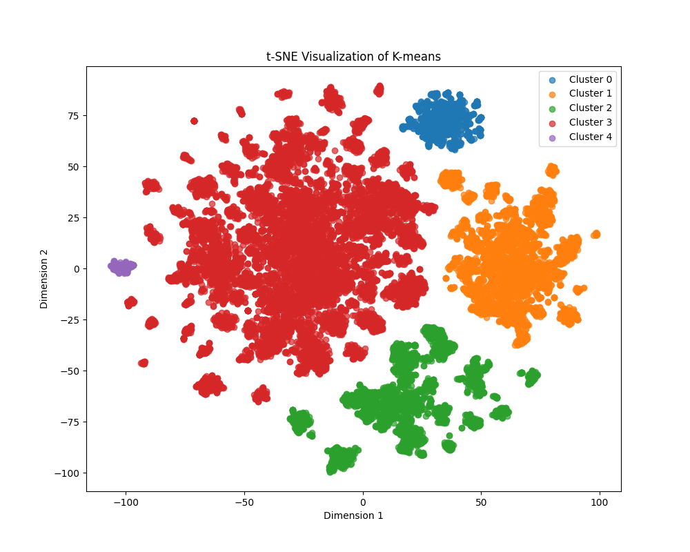
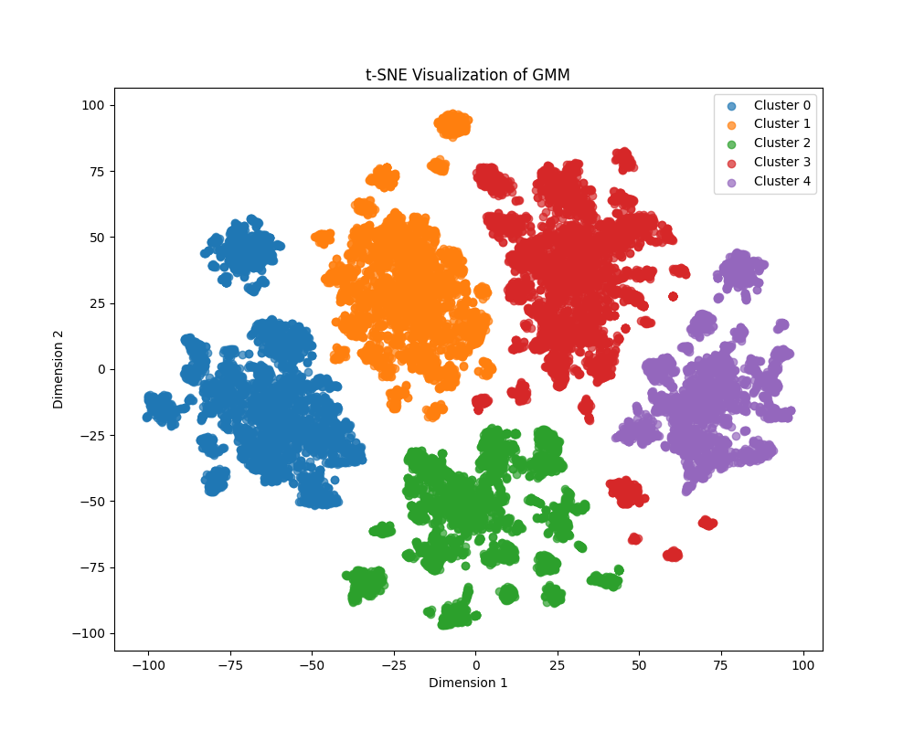

# Machine Learning Text Clustering and Analysis Project

## Project Introduction
This project aims to perform cleaning, preprocessing, feature extraction, dimensionality reduction, and multiple clustering analyses on large-scale text data, with statistical and visual analysis of clustering results. It is suitable for topic discovery and publication distribution analysis of academic papers, news, and other text data.

## Dependencies
- Python 3.7+
- pandas
- numpy
- scikit-learn
- matplotlib
- tqdm
- nltk
- hdbscan

> **Note:**
> Please make sure to download the required nltk data packages in advance (such as punkt, averaged_perceptron_tagger, stopwords, words).

Example installation:
```bash
pip install pandas numpy scikit-learn matplotlib tqdm nltk hdbscan
```

## Dataset
The dataset and processed data can be downloaded here: https://pan.quark.cn/s/8e66bc31bcf3 (Extraction code: DPVM)
Data files are located in the `datasets/` directory, mainly including:
- `Dataset.csv`: Original dataset
- `Cleaned_Dataset.csv`: Data after removing rows with empty content
- `Sampled_Dataset.csv`: 10% sampled data
- `process_Sampled_Dataset.csv`: Preprocessed data
- `Vocab1_Table.csv`: Original vocabulary table
- `Filtered_Vocab_Table.csv`: Simplified vocabulary table
- `TFIDF_Matrix.npz`: TF-IDF sparse matrix
- `Reduced_TFIDF_Matrix.csv`: SVD-reduced TF-IDF matrix (100 dimensions)
- `Clustered_dbscan_test_.csv`, `Clustered_GMM_100.csv`, `Clustered_kmeans_100.csv`, etc.: Results of different clustering methods

## Script Descriptions
- `process.py`: Clean the original data and remove rows with empty content.
- `sample.py`: Take a 10% sample from the cleaned dataset.
- `preprocessing.py`: Preprocess text (lowercase, remove symbols, tokenize, stemming, remove proper nouns, etc.).
- `simplify_vocabulary.py`: Tokenize, stem, remove proper nouns, count word frequency, and generate the original vocabulary table.
- `keep_simply.py`: Filter the vocabulary using the nltk English word list, keeping only standard English words, and output a simplified vocabulary table.
- `TfIdf.py`: Build the TF-IDF matrix using the simplified vocabulary and preprocessed text, and save it.
- `diomention_check.py`: Check the distribution of the TF-IDF matrix and vocabulary, filter words by specific quantiles, and rebuild the TF-IDF matrix.
- `dimension_reduction.py`: Perform SVD dimensionality reduction (100 dimensions) on the TF-IDF sparse matrix and merge article metadata.
- `DBSCAN.py`: Cluster the reduced TF-IDF matrix using DBSCAN, and output statistics and visualizations.
- `GMM.py`: Cluster using Gaussian Mixture Model (GMM), output publication and cluster statistics, and visualizations.
- `kmens.py`: Cluster using KMeans, output publication and cluster statistics, and visualizations.
- `HDBSCAN.py`: Cluster using HDBSCAN, output clustering results and 2D visualizations.
- `test.py`: Auxiliary script for computing k-distance graphs to assist DBSCAN parameter selection.

## Workflow
1. Data cleaning:
   ```bash
   python process.py
   ```
2. Data sampling:
   ```bash
   python sample.py
   ```
3. Text preprocessing:
   ```bash
   python preprocessing.py
   ```
4. Vocabulary generation and simplification:
   ```bash
   python simplify_vocabulary.py
   python keep_simply.py
   ```
5. Build TF-IDF matrix:
   ```bash
   python TfIdf.py
   ```
6. Dimensionality reduction:
   ```bash
   python dimension_reduction.py
   ```
7. Clustering and analysis (choose one or all):
   ```bash
   python DBSCAN.py
   python GMM.py
   python kmens.py
   python HDBSCAN.py
   ```
8. Visualization and statistical analysis:
   - Clustering scripts will automatically output statistical tables and visual images.
   - You can view some visualization results in the `实验结果图片/` (Experiment Results Images) directory.

## Visualization Results
- Supports various visualizations such as cluster distribution, publication statistics, Gantt charts, and t-SNE scatter plots.
- Visualization images will pop up or be saved automatically after running clustering scripts.

### k-means Clustering Results
- t-SNE Visualization (Figure_5):



### GMM Clustering Results
- t-SNE Visualization (Figure_5):



## Notes
- Please adjust file paths according to your environment.
- The dataset is large, and some scripts may take a long time to run.
- For further customization or an updated README, please contact the maintainer.
