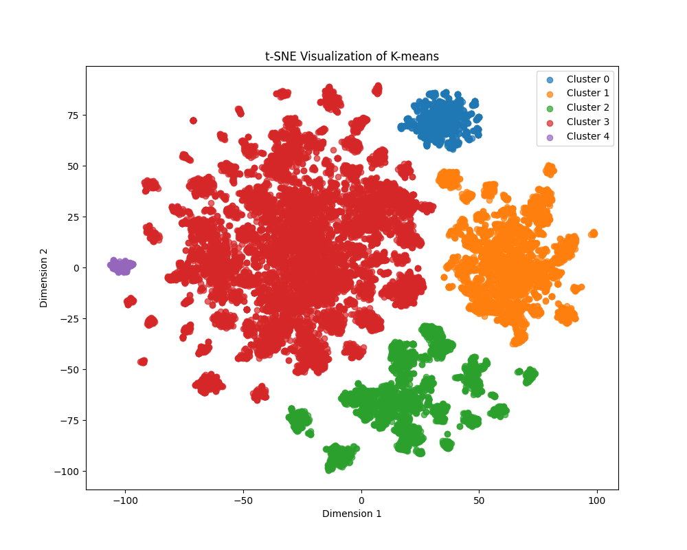
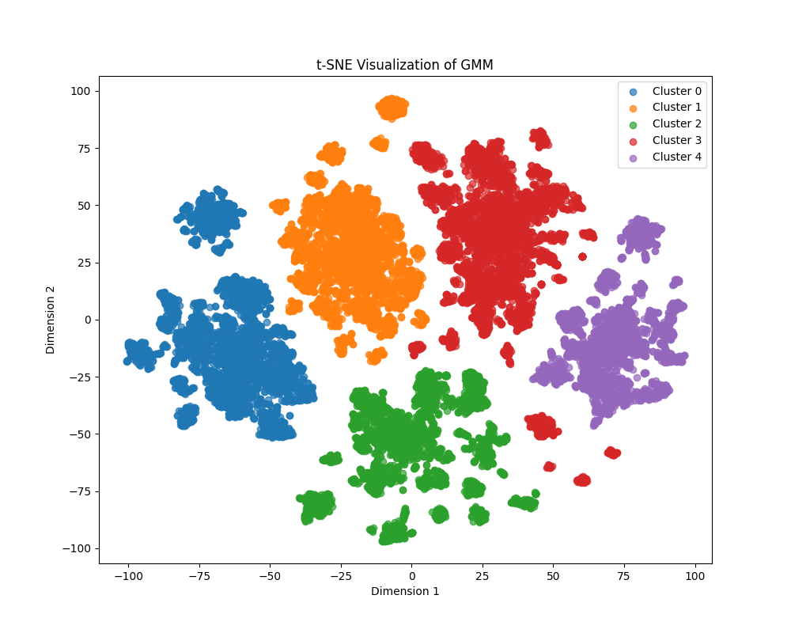

# 机器学习文本聚类与分析项目

## 项目介绍
本项目旨在对大规模文本数据进行清洗、预处理、特征提取、降维和多种聚类分析，并对聚类结果进行统计和可视化分析。适用于学术论文、新闻等文本数据的主题发现和发表分布分析。

## 依赖
- Python 3.7+
- pandas
- numpy
- scikit-learn
- matplotlib
- tqdm
- nltk
- hdbscan

> **注意：**
> 请确保提前下载所需的 nltk 数据包（如 punkt, averaged_perceptron_tagger, stopwords, words）。

安装示例：
```bash
pip install pandas numpy scikit-learn matplotlib tqdm nltk hdbscan
```

## 数据集
数据集和处理后的数据可在此下载：https://pan.quark.cn/s/8e66bc31bcf3（提取码：DPVM）
数据文件位于 `datasets/` 目录下，主要包括：
- `Dataset.csv`：原始数据集
- `Cleaned_Dataset.csv`：删除空内容行后的数据
- `Sampled_Dataset.csv`：10% 采样数据
- `process_Sampled_Dataset.csv`：预处理后的数据
- `Vocab1_Table.csv`：原始词汇表
- `Filtered_Vocab_Table.csv`：简化后的词汇表
- `TFIDF_Matrix.npz`：TF-IDF 稀疏矩阵
- `Reduced_TFIDF_Matrix.csv`：SVD 降维后的 TF-IDF 矩阵（100 维）
- `Clustered_dbscan_test_.csv`, `Clustered_GMM_100.csv`, `Clustered_kmeans_100.csv` 等：不同聚类方法的结果

## 脚本说明
- `process.py`：清洗原始数据，删除空内容行
- `sample.py`：从清洗后的数据集中抽取 10% 样本
- `preprocessing.py`：文本预处理（小写化、去除符号、分词、词干提取、去除专有名词等）
- `simplify_vocabulary.py`：分词、词干提取、去除专有名词、统计词频，生成原始词汇表
- `keep_simply.py`：使用 nltk 英语单词列表过滤词汇表，仅保留标准英语单词，输出简化词汇表
- `TfIdf.py`：使用简化词汇表和预处理文本构建 TF-IDF 矩阵并保存
- `diomention_check.py`：检查 TF-IDF 矩阵和词汇表的分布，按特定分位数过滤词语，重建 TF-IDF 矩阵
- `dimension_reduction.py`：对 TF-IDF 稀疏矩阵进行 SVD 降维（100 维），并合并文章元数据
- `DBSCAN.py`：使用 DBSCAN 对降维后的 TF-IDF 矩阵进行聚类，输出统计信息和可视化结果
- `GMM.py`：使用高斯混合模型（GMM）进行聚类，输出发表和聚类统计信息及可视化结果
- `kmens.py`：使用 KMeans 进行聚类，输出发表和聚类统计信息及可视化结果
- `HDBSCAN.py`：使用 HDBSCAN 进行聚类，输出聚类结果和 2D 可视化
- `test.py`：辅助脚本，用于计算 k 距离图以协助 DBSCAN 参数选择

## 工作流程
1. 数据清洗：
   ```bash
   python process.py
   ```
2. 数据采样：
   ```bash
   python sample.py
   ```
3. 文本预处理：
   ```bash
   python preprocessing.py
   ```
4. 词汇表生成和简化：
   ```bash
   python simplify_vocabulary.py
   python keep_simply.py
   ```
5. 构建 TF-IDF 矩阵：
   ```bash
   python TfIdf.py
   ```
6. 降维：
   ```bash
   python dimension_reduction.py
   ```
7. 聚类和分析（选择一个或全部）：
   ```bash
   python DBSCAN.py
   python GMM.py
   python kmens.py
   python HDBSCAN.py
   ```
8. 可视化和统计分析：
   - 聚类脚本将自动输出统计表和可视化图像
   - 可在 `result/`（实验结果图像）目录查看部分可视化结果

## 可视化结果
- 支持各种可视化，如聚类分布、发表统计、甘特图和 t-SNE 散点图
- 运行聚类脚本后会自动弹出或保存可视化图像

### k-means 聚类结果
- t-SNE 可视化（图 5）：



### GMM 聚类结果
- t-SNE 可视化（图 5）：



## 注意事项
- 请根据实际环境调整文件路径
- 数据集较大，部分脚本可能需要较长运行时间

